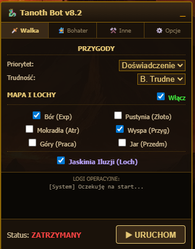
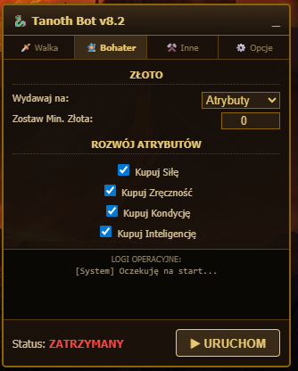
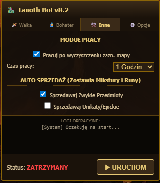
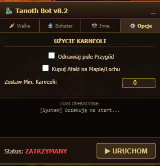

<h1 align="center">Tanoth Premium Auto-Bot</h1>

  
  
  
  

> Kompleksowe, asynchroniczne narzędzie (Userscript) automatyzujące rozgrywkę w przeglądarkowej grze RPG **Tanoth**. Skrypt został zaprojektowany z myślą o maksymalnej optymalizacji czasu i zasobów, działając w tle poprzez bezpośrednią komunikację z serwerem gry za pomocą zapytań XML-RPC.

 

## 📑 Spis treści
- [Kluczowe funkcjonalności](#-kluczowe-funkcjonalności)
- [Architektura i Bezpieczeństwo](#-architektura-i-bezpieczeństwo)
- [Instalacja](#-instalacja)
- [Konfiguracja (GUI)](#-konfiguracja-gui)
- [Zastrzeżenia prawne](#-oświadczenie-disclaimer)

---

## 🚀 Kluczowe funkcjonalności

### 1. Inteligentny Silnik Walki (Adventures & Map)
* **Zarządzanie przygodami:** Automatyczny dobór optymalnych misji na podstawie priorytetu (Złoto / Doświadczenie) oraz maksymalnego poziomu trudności.
* **Smart Map Parsing:** Skrypt dynamicznie skanuje mapę, filtrując martwe cele. Atakuje wyłącznie żywe potwory w wybranych, aktywnych strefach.
* **Jaskinia Iluzji:** Automatyczne realizowanie codziennego, darmowego wejścia do lochu z opcją wykupywania kolejnych za Karneole.

### 2. Moduł Ekonomii i Rozwoju (Economy & Upgrades)
* **Auto-Sprzedaż (Smart Sell):** Algorytm filtrujący zawartość ekwipunku. Skrypt identyfikuje jakość przedmiotów (Zwykłe / Unikatowe) i automatycznie spienięża niepotrzebny sprzęt u Handlarza.
* **Rozwój Atrybutów i Kręgu:** Algorytmiczne inwestowanie nadwyżek złota w wybrane statystyki postaci oraz priorytetyzacja rozbudowy Kręgu.

### 3. Moduł Automatyzacji Czasu Wolnego
* **Auto-Praca:** Bot autonomicznie weryfikuje status mapy oraz przygód. Jeśli limit darmowych akcji zostanie wyczerpany, a terytoria mapy są puste, skrypt wysyła postać do Pracy na zdefiniowany przez użytkownika czas (od 1 do 12 godzin).

---

## 🛡 Architektura i Bezpieczeństwo

* **Asynchroniczna Pętla Zdarzeń:** Bot wykorzystuje nowoczesne promisy i funkcje `async/await` do płynnego operowania w tle bez blokowania (zamrażania) głównego wątku przeglądarki.
* **Pływający Interfejs (Draggable GUI):** Skrypt wstrzykuje własny, nienaruszający struktury strony interfejs z możliwością swobodnego pozycjonowania (Drag & Drop) oraz minimalizacji.
* **Zabezpieczenie Ekwipunku (Safe-Lock):** Moduł sprzedaży posiada twarde ograniczenia (hard-coded limits) na wybrane typy danych (np. Type 9, Type 10). Bot **nigdy** nie sprzeda założonego rynsztunku, mikstur, run ani kamieni wzmacniających.

---

## 🛠 Instalacja

1. Pobierz i zainstaluj menedżer skryptów w swojej przeglądarce:
   * [Tampermonkey dla Chrome](https://chrome.google.com/webstore/detail/tampermonkey/dhdgffkkebhmkfjojejmpbldmpobfkfo)
   * [Tampermonkey dla Firefox](https://addons.mozilla.org/pl/firefox/addon/tampermonkey/)
2. Kliknij w poniższy link, aby rozpocząć proces integracji skryptu:
   
   👉 **[ZAINSTALUJ SKRYPT](../../raw/main/tanoth-bot.user.js)**

3. W oknie wtyczki kliknij `Zainstaluj`.
4. Wejdź do gry Tanoth i zaloguj się na postać. Interfejs uruchomi się automatycznie w prawym dolnym rogu ekranu.

---

## ⚙ Konfiguracja (GUI)

Interfejs bota podzielony jest na logiczne zakładki, aby ułatwić zarządzanie konfiguracją w czasie rzeczywistym:
* **Walka:** Wybór terytoriów do patrolowania, trudności przygód i priorytetów nagród.
* **Bohater:** Zarządzanie minimalnym pułapem złota oraz wybór atrybutów do automatycznego ulepszania.
* **Inne:** Aktywacja modułu Pracy po wyczyszczeniu zasobów oraz konfiguracja filtrów automatycznej sprzedaży przedmiotów.
* **Opcje:** Restrykcje dotyczące zużywania waluty premium (Karneoli).
* **Konsola:** Wbudowany log operacyjny wyświetlający na żywo akcje podejmowane przez serwer.

---

## ⚠️ Oświadczenie (Disclaimer)

Narzędzie to powstało wyłącznie jako eksperyment programistyczny i projekt badawczy typu *Proof of Concept*. Używanie zautomatyzowanych skryptów (botów) łamie zasady Regulaminu (Terms of Service) firmy Gameforge. 

Autor repozytorium udostępnia kod na licencji open-source i nie ponosi żadnej odpowiedzialności za zablokowanie (ban) lub zawieszenie kont w grze, wynikające z jego użytkowania. Korzystasz z tego oprogramowania wyłącznie na własne ryzyko.
